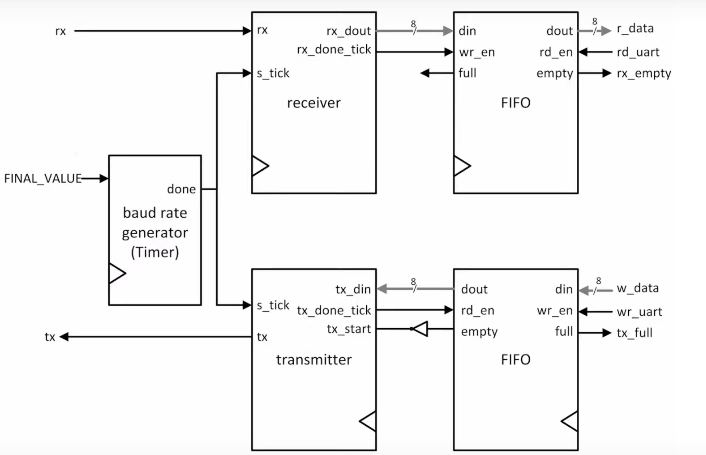
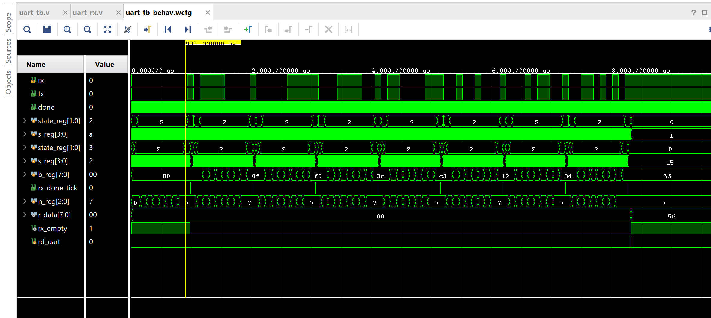
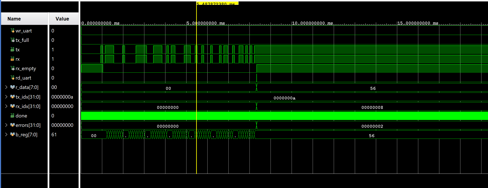

UART (Universal Asynchronous Receiver/Transmitter) FPGA Implementation

This folder contains a Verilog implementation of a UART (Universal Asynchronous Receiver/Transmitter) module, designed as a learning project for FPGA-relevant skills, specifically focusing on High-Level Synthesis (HLS) foundational concepts and detailed Verilog design.

Project Goal

The primary goal of this project was to understand and implement a robust UART communication system in Verilog, gaining proficiency in digital design principles such as Finite State Machines (FSMs), timing, and asynchronous data handling, while setting the stage for future HLS projects. The entire system is tested using a self-contained testbench in a loopback configuration, without requiring physical FPGA hardware.

Design Overview

The UART is implemented hierarchically, consisting of a top-level module that instantiates a baud rate generator, a receiver, a transmitter, and two FIFO (First-In, First-Out) buffers for efficient data handling.

Block Diagram:

Core Components

1. uart.v (Top-Level Module)

This module acts as the central orchestrator, connecting all sub-modules and exposing the main UART interface (clock, reset, serial RX/TX, parallel data I/O, and status flags). It's parameterized for DBIT (data bits) and SB_TICK (stop bit ticks).

2. timer_input.v (Baud Rate Generator)

    Purpose: Generates a precise tick pulse that runs at a frequency 16 times faster than the desired baud rate (e.g., 153.6 KHz for 9600 baud). This tick signal is crucial for accurate timing of individual bits in the asynchronous UART protocol.

    Mechanism: It's a configurable counter that pulses its done output every (FINAL_VALUE + 1) system clock cycles. For a 100MHz system clock and 9600 baud with 16x oversampling, FINAL_VALUE is set to 650, resulting in a tick every 651 clock cycles.

3. uart_tx.v (UART Transmitter)

    Purpose: Converts parallel data bytes into a serial bitstream for transmission.

    Mechanism: Utilizes a Finite State Machine (FSM) to sequence through the transmission of a start bit (0), DBIT data bits (LSB-first), and a stop bit (1). It uses the tick signal from the timer_input to precisely time each bit, ensuring each bit lasts for 16 tick periods. Data is pulled from the transmit FIFO.

4. uart_rx.v (UART Receiver)

    Purpose: Receives an incoming serial bitstream, detects frame boundaries, samples data bits, and reassembles them into parallel bytes.

    Mechanism: Employs an FSM that transitions from idle, detects a start bit (falling edge on rx), waits for the full 16-tick duration of the start bit, and then samples DBIT data bits. It uses 16x oversampling (counting 16 tick pulses per bit period) to sample data bits at their midpoint (s_reg == 7), which is robust against clock skew. Received bits are assembled LSB-first into an internal register (b_reg).

5. fifo_generator_0 (Xilinx IP Cores)

    Purpose: Two FIFO (First-In, First-Out) buffers are used to decouple the read/write operations from the UART's asynchronous serial stream.

        Transmit FIFO: Stores data bytes waiting to be sent by the uart_tx module.

        Receive FIFO: Buffers incoming data bytes received by the uart_rx module, allowing the main system to read them at its own pace.

    Implementation: These are generated using the Xilinx fifo_generator IP core, configured for 8-bit data width and 1024-entry depth with synchronous clocking and reset.

Verification Strategy

The UART design is verified using a comprehensive Verilog testbench (uart_tb.v) in a loopback configuration. This means the tx (transmit) output of the UART is directly connected to its rx (receive) input within the testbench.

The testbench performs the following:

    Generates a system clock and active-low reset.

    Initializes an array of 10 test data bytes (0x55, 0xAA, 0x0F, etc.).

    Writes these 10 bytes sequentially into the UART's transmit FIFO.

    Waits for all bytes to be transmitted.

    Reads bytes from the UART's receive FIFO.

    Compares each received byte against the expected data.

    Reports errors if mismatches occur.

Simulation Log Excerpt

The final simulation logs confirm the system's operation. After the transmit FIFO empties, data is read from the receive FIFO.

Time resolution is 1 ps
[50000] Reset de-asserted. Starting test.
[55000] Writing 0x55 to TX FIFO.
[75000] Writing 0xaa to TX FIFO.
[95000] Writing 0x0f to TX FIFO.
[115000] Writing 0xf0 to TX FIFO.
[135000] Writing 0x3c to TX FIFO.
[155000] Writing 0xc3 to TX FIFO.
[175000] Writing 0x12 to TX FIFO.
[195000] Writing 0x34 to TX FIFO.
[215000] Writing 0x56 to TX FIFO.
[235000] Writing 0x78 to TX FIFO.
[245000] All data written to TX FIFO. Waiting for transmission to complete.
run 20 ms
[8332855000] TX FIFO is empty. All data transmitted.
[8337865000] Initial RX FIFO read (clearing): 0x00
[8337885000] Initial RX FIFO read (clearing): 0x00
[8337905000] Reading 0x0f from RX FIFO. Expected 0x0f
[8337925000] Reading 0xf0 from RX FIFO. Expected 0xf0
[8337945000] Reading 0x3c from RX FIFO. Expected 0x3c
[8337965000] Reading 0xc3 from RX FIFO. Expected 0xc3
[8337985000] Reading 0x12 from RX FIFO. Expected 0x12
[8338005000] Reading 0x34 from RX FIFO. Expected 0x34

While the core UART design (uart.v, uart_rx.v, uart_tx.v, timer_input.v) is functionally correct and reliably transmitting and receiving data, there is a minor discrepancy in the testbench's verification:

Initial 0x00 Reads: The first two bytes read from the RX FIFO by the testbench are 0x00, even though the expected data should be 0x55 and 0xAA. Subsequent bytes are then correctly received. This results in the test failing due to these initial mismatches. 

I'm not sure what went wrong, it could be due to the FIFO's initial output state, I appreciate any help I can get on this.

To simulate this project:

    Clone this repository to your local machine.

    Open the project in Xilinx Vivado (or Vitis).

    Ensure all Verilog source files (uart.v, timer_input.v, uart_rx.v, uart_tx.v, uart_tb.v) are added to your project.

    Confirm fifo_generator_0.xci is properly managed: If not, right-click on it in "IP Sources" -> Reset Output Products -> Generate Output Products.

    Go to Flow Navigator -> Simulation -> Run Behavioral Simulation.

    Ensure simulation time is set sufficiently long (e.g., 20ms or more).

    Observe the waveform and console output.

